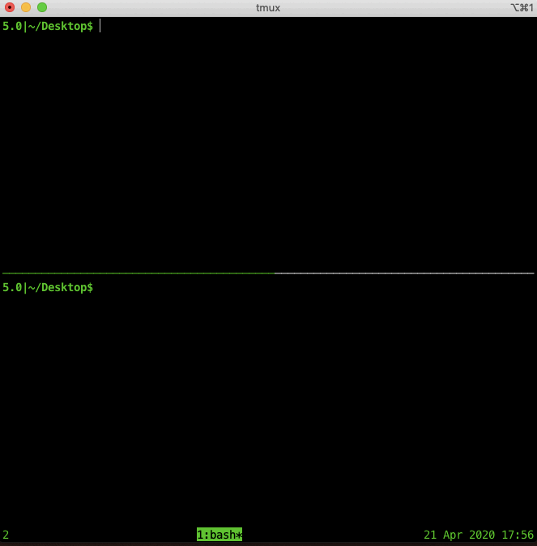
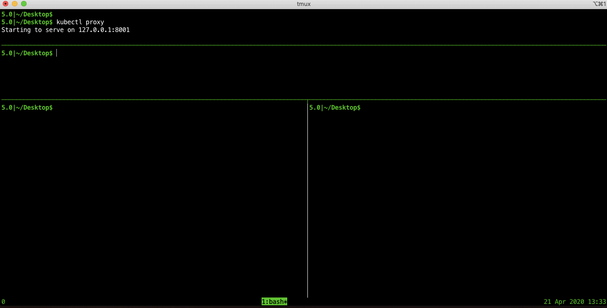

# The world's simplest Kubernetes dashboard

A command-line based Kubernetes "dashboard" displaying the Pods in a given namespace in real-time.

The dashboard is implemented as a [Bash script](dashboard.sh) with less than 30 lines of code.




## Usage

```bash
./dashboard.sh
```

To quit, type **_Ctrl-C_**.

By default, the `default` namepace is used. You can set a different namespace by passing it as an argument.

For example:

```bash
./dashboard.sh kube-system
```

## Dependencies

The Bash script requires the following commands to be installed on the local system:

- [**`jq`**](https://stedolan.github.io/jq/)
    ```bash
    # macOS
    brew install jq
    # Linux
    sudo apt-get install -y jq
    ```
- [**`watch`**](https://linux.die.net/man/1/watch)
    ```bash
    # macOS
    brew install watch
    # Linux
    # Installed by default
    ```
- [**`curl`**](https://curl.haxx.se/)
    ```bash
    # macOS
    # Installed by default
    # Linux
    # sudo apt-get install -y curl
    ```

## Minimal "one-liner" execution

If you want to run the dashboard in a minimal "one-liner" fashion, you can do so as follows:

1. Start kubectl proxy:
    ```bash
    kubectl proxy
    ```
1. Access and parse the [`list Pods (watch)`](https://kubernetes.io/docs/reference/generated/kubernetes-api/v1.18/#list-pod-v1-core) API endpoint:
    ```bash
    unbuffer curl 'localhost:8001/api/v1/namespaces/default/pods?watch' | while read -r line; do name=$(jq -r .object.metadata.name <<<"$line"); case $(jq -r .type <<<"$line") in ADDED) echo "$name" >>pods.txt;; DELETED) sed -i "/^$name$/d" pods.txt;; esac; done
    ```
1. Display the state file:
    ```
    watch -n 0.1 cat pods.txt
    ```

Here's how this might look like:




